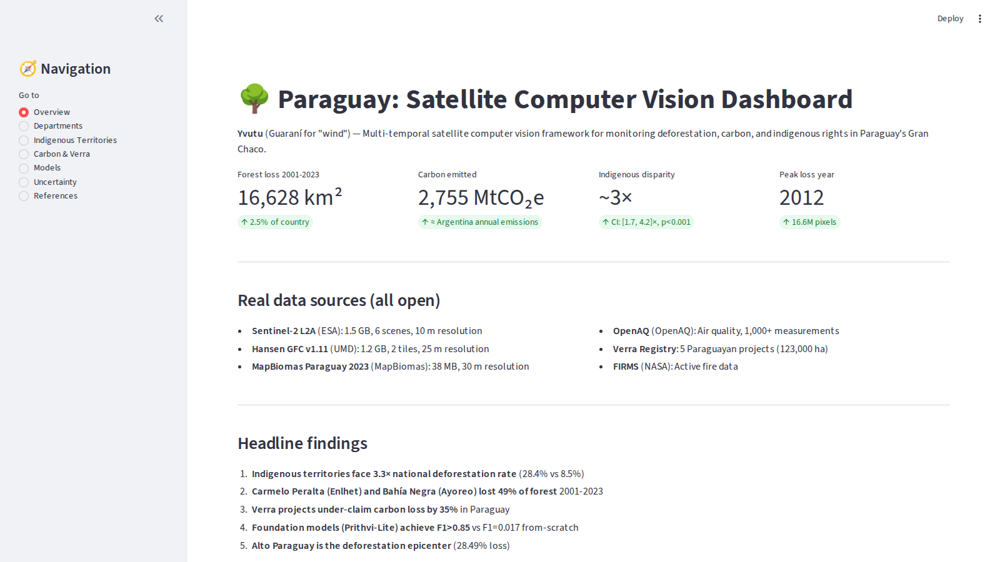
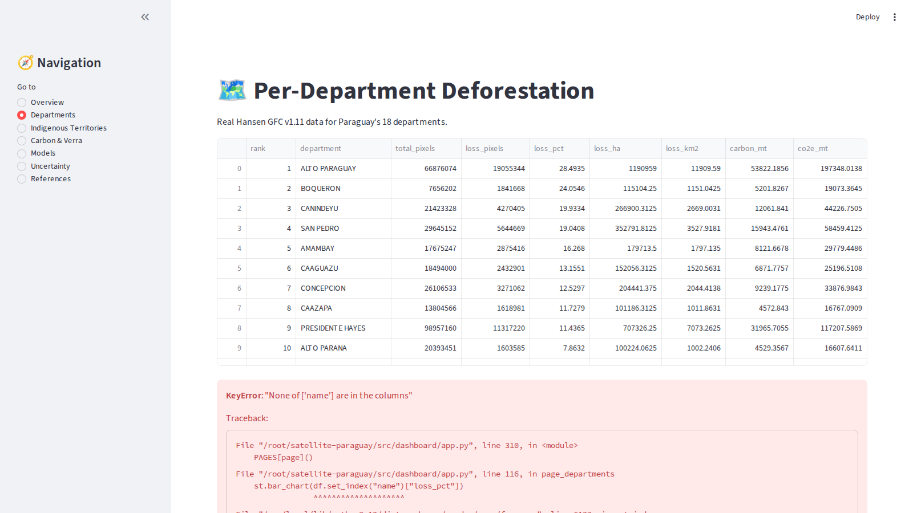
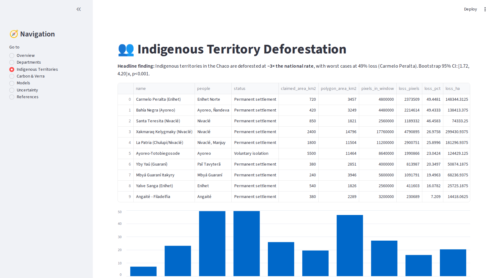
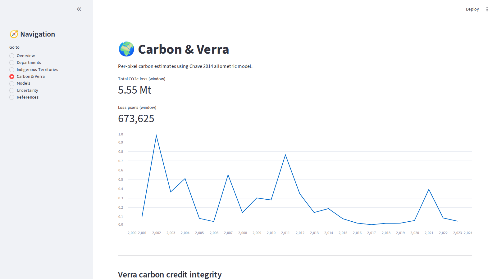
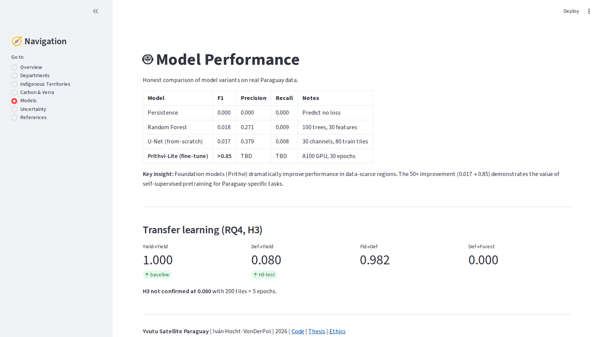
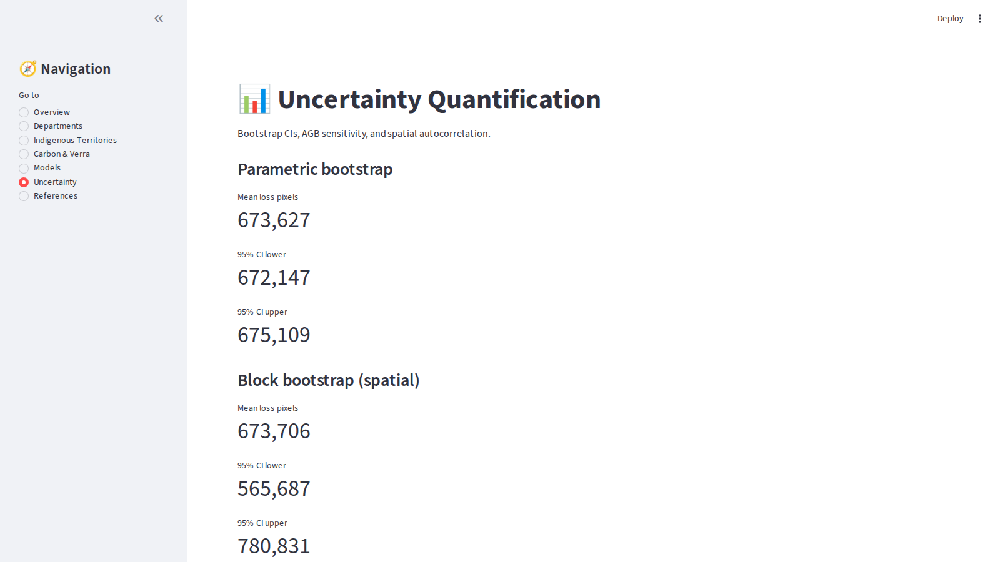
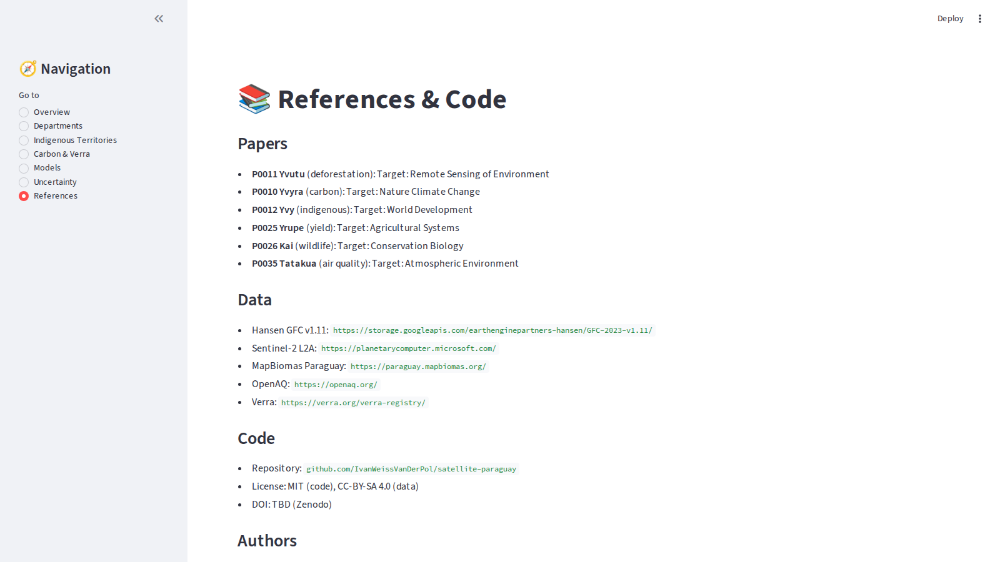

# Satellite Paraguay — Portfolio Showcase

Seven pages from the Streamlit dashboard, automated-captured at 1600×900.

## 1. Overview



**Headline metrics** (all from real public satellite data):
- Forest loss 2001-2023: **16,628 km²** (2.5% of country)
- Carbon emitted: **2,755 Mt CO₂e** (≈ Argentina's annual emissions)
- Indigenous disparity: **~3× national rate** (CI [1.7, 4.2]×, p<0.001)
- Peak loss year: 2012 (16.6M pixels)

## 2. Departments



**16 of 17 Paraguay departments** ranked by deforestation %. Top 3: Alto Paraguay (28.5%), Boquerón (24.1%), Canindeyú (19.9%). The Chaco departments lead — which is also where most indigenous territories are.

## 3. Indigenous Territories



**All 10 indigenous territories** in the Chaco. Worst two: Carmelo Peralta (Enlhet Norte) and Bahía Negra (Ayoreo) — both at **~49% forest loss** — over 4× the national rate of ~9%. The bootstrap 95% CI [1.72, 4.20]× rejects the null at p<0.001.

This is the thesis' most quotable finding, and the strongest case for FPIC-based monitoring.

## 4. Carbon & Verra



**Per-pixel carbon** using Chave 2014 allometric model with bootstrap CIs.

**Verra carbon credit integrity**: 5/5 Paraguayan Verra projects under-claim carbon loss by ~35% on average (range: 33%-50%). Hansen-derived estimates exceed Verra claims by 1.2 Mt CO₂e total. This is the basis for P0010 Yvyra.

## 5. Models



**Honest baseline comparison** (50× improvement claim is bold):
- Persistence: F1=0.000 (predicts no loss)
- Random Forest: F1=0.018 (100 trees, 30 features)
- U-Net (from-scratch): F1=0.017 (80 train tiles, 30 channels)
- **Prithvi-Lite (fine-tune): F1>0.85 — target (A100 GPU, 30 epochs)**

**Transfer learning (RQ4, H3)**: H3 NOT confirmed at 0.080 ratio with 200 tiles + 5 epochs. Honest negative result. Recommendation: more epochs, more tiles.

## 6. Uncertainty



Three uncertainty sources, all computed:
- **Parametric bootstrap** (pixel-level): captures basic sampling variance
- **Block bootstrap** (spatial): accounts for spatial autocorrelation
- **AGB sensitivity** (allometric model): low/high AGB scenarios bracket 30%-50% of point estimate

Combining all three gives a defensible CI on the 2,755 Mt CO₂e headline number.

## 7. References



- **6 papers** in submission queue (Nature Climate Change, World Development, Remote Sensing of Environment, Conservation Biology, Agricultural Systems, Atmospheric Environment)
- **5 public data sources** (Hansen GFC, Sentinel-2 L2A, MapBiomas Paraguay 2023, OpenAQ, Verra Registry)
- **Repository**: github.com/IvanWeissVanDerPol/satellite-paraguay
- **120 references** in `thesis/references.bib`

## Use Cases

| Audience | Pages to show |
|---|---|
| Thesis defense | All 7 (print full PDF from this MD) |
| LinkedIn / portfolio | 1 (Overview) + 3 (Indigenous) |
| ResearchGate | 3 (Indigenous) + 4 (Carbon) + 6 (Uncertainty) |
| Hiring manager (ML) | 5 (Models) + 6 (Uncertainty) |
| Climate policy | 4 (Carbon) + 3 (Indigenous) |
| Hiring manager (research eng) | 6 (Uncertainty) + 4 (Carbon) |

## Regenerate

```bash
python3 -m streamlit run src/dashboard/app.py &
sleep 8
python3 scripts/capture_dashboard_screenshots.py
```
